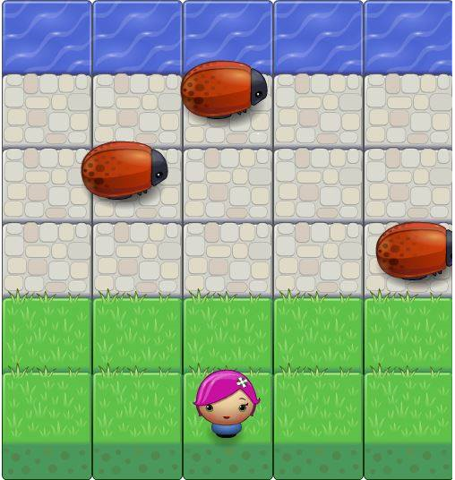

# Classic Arcade Game Clone Project

In this game we have a Player and three Enemies (Bugs).
The goal of the player is to reach the othe side of water, without colliding into any one of the enemies.
The player can move left, right, up and down.
The enemies move in varying speeds on the paved block portion of the scene.
Once the player collides with an enemy, the game is reset and the player moves back to the start square. 
Once the player reaches the water the game is won.

## Demo

